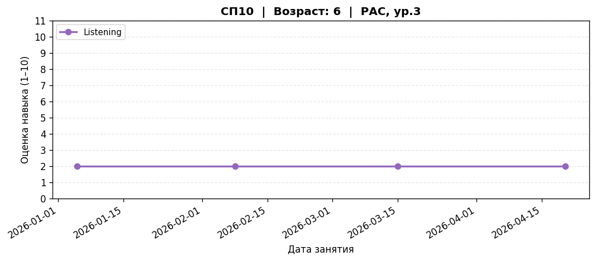

# children_pipeline

Тестовое задание в сбер с реализацией автоматического пайплайна для выявления случаев отсутствия прогресса у детей
с РАС/ОВЗ по данным сессионных оценок навыков.

---

## Способы запуска

### Вариант 1 — venv

```bash
git clone <repo-url>
cd children_pipeline

python -m venv .venv
source .venv/bin/activate
pip install -r requirements.txt

python pipeline.py run
```

### Вариант 2 — Docker

```bash
docker build -t children_pipeline .
docker run --rm \
  -v $(pwd)/data:/app/data \
  -v $(pwd)/outputs:/app/outputs \
  children_pipeline run
```

### Результаты

После запуска в папке `outputs/` появятся:

```
outputs/
├── stagnation_report.csv # Сводный отчёт по застою
├── stagnation_report.xlsx # Сводный отчёт по застою в формате excel
├── summary.md # Отчет для супервизора
└── plots/
    ├── СП02.png # График динамики оценок
    ├── СП10.png
    └── ...
```

---

## Используемые технологии и обоснование

| Технология | Версия | Зачем |
|---|---|---|
| **pandas** | ≥ 2.0 | Для работ с DataFrame |
| **numpy** | ≥ 1.24 | Вычислени дельт |
| **openpyxl** | ≥ 3.1 | Чтение/запись `.xlsx` с условным форматированием |
| **matplotlib** | ≥ 3.7 | Графики |
| **click** | ≥ 8.1 | CLI с `--help`, валидацией путей и компонуемыми командами |
| **pytest** | ≥ 7.4 | Юнит-тесты |
| **pytest-cov** | ≥ 4.1 | Покрытие кода для CI |

---

## Архитектура решения

```
children_pipeline/
├── pipeline.py # Главная генерация пайплайна
├── requirements.txt # Верссии библиотек
├── Dockerfile
│
├── data/
│   └── children_sessions.xlsx
│
├── src/
│   ├── constants.py # Числа и строки
│   ├── schema.py # функция enforce_schema()
│   ├── validator.py # Валидация + авторемонт; возвращает (cleaned_df, issues_df)
│   ├── analysis.py # detect_stagnation(df, min_days)
│   └── reporting.py # export_report / plot_dynamics / generate_summary
│
├── tests/
│   ├── conftest.py # Общие тестовые приложения pytest
│   ├── test_analysis.py # ~13 тестов: дельты, уровни риска, граничные случаи
│   └── test_validator.py # ~14 тестов: column-shift, диапазон score, child_id
│
└── outputs/ # Создается при запуске
    ├── stagnation_report.csv
    ├── stagnation_report.xlsx
    ├── summary.md
    └── plots/
```

### Пайплайн обработки данных

1. **validate()** — читает сырые данные, восстанавливает структуру:
   - Ремонтирует «сдвиг колонок» (`specialist_type` попал в `progress_flag`) — 85 % строк
   - Нормализует опечатки (`импровед` → `improved`)
   - Удаляет дубли
   - Тегирует каждую строку `_validation_status ∈ {ok, repaired, invalid}`

2. **detect_stagnation(df, min_days=28)** — для каждой пары (child_id, domain):
   - Определяет окно анализа: `[latest_date − min_days, latest_date]`
   - Находит максимальный score в окне
   - Если `max_score_in_window ≤ score_at_window_start` → застой
   - Считает `stagnation_days` от последнего улучшения до сегодня
   - Присваивает уровень риска: HIGH (≥56 дн.), MEDIUM (≥28 дн.), LOW (недостаточно данных)

3. **reporting** — три независимых экспортёра, каждый идемпотентен.

---

## Компромиссы

| Решение | Альтернатива | Почему так |
|---|---|---|
| «Застой» = нет роста score в окне | Учитывать комментарии/флаги специалиста | Score — единственная числовая метрика; NLP комментариев потребовал бы LLM или ручной разметки |
| Окно = фиксированные `min_days` от последней сессии | Скользящее среднее, CUSUM | Проще объяснять специалистам; не требует настройки доп. параметров |
| Авторемонт column-shift без удаления строк | Отбрасывать «кривые» строки | В данных системная ошибка (~85 %); удаление убило бы весь датасет |
| HIGH risk ≥ 56 дн., LOW = нехватка данных | Иная шкала | 56 дн. ≈ 2 учебных месяца — разумный клинический порог |
| Дубли удаляются по полному совпадению строки | Дедупликация по (child_id, domain, date) | Точное совпадение безопаснее; частичные дубли логируются отдельно |

---

## Как проверить работу

### Запуск тестов

```bash
# Все тесты
python -m pytest tests/ -v

# С покрытием
python -m pytest tests/ --cov=src --cov-report=term-missing
```

### Валидация отчёта

```bash
# Проверить что CSV создан и содержит ожидаемые колонки
python -c "
import pandas as pd
df = pd.read_csv('outputs/stagnation_report.csv')
print(df.shape)
print(df['risk_level'].value_counts())
print(df[['child_id','domain','risk_level','stagnation_days']].to_string())
"
```

### Только валидация входных данных

```bash
python pipeline.py validate
```

---

## Примеры вызовов CLI

```bash
# Полный пайплайн со стандартными параметрами
python pipeline.py run

# Уменьшить порог до 14 дней, сохранить в другую папку
python pipeline.py run --min-days 14 --output-dir /tmp/report

# Без генерации графиков (быстрее для CI)
python pipeline.py run --no-plots

# Нарисовать графики только для двух детей
python pipeline.py plot --child-ids СП01 --child-ids СП10

# Только валидация
python pipeline.py validate --input data/children_sessions.xlsx

# Справка
python pipeline.py run --help
```

---

## Примеры вызовов Python API

```python
from src.validator import load_and_validate
from src.analysis import detect_stagnation
from src.reporting import export_report, plot_dynamics, generate_summary

# 1 Загрузить и провалидировать
result = load_and_validate("data/children_sessions.xlsx")

# 2 Найти застой
report = detect_stagnation(result.cleaned, min_days=28)

# 3 Экспортировать
export_report(report, output_dir="outputs")
plot_dynamics(result.cleaned, output_dir="outputs")
generate_summary(report, output_dir="outputs", min_days=28)
```

---

## Скриншоты графиков

Пример графика для **СП10** (HIGH risk, Listening — 105 дней без прогресса):



Оценка не менялась с 2 на протяжении всего периода наблюдения.
---

## Структура выходных данных

### stagnation_report.csv / .xlsx

| Колонка | Описание |
|---|---|
| `child_id` | Псевдоним ребёнка (СПxx) |
| `domain` | Область навыка |
| `age` | Возраст |
| `diagnosis` | Диагноз |
| `risk_level` | HIGH / MEDIUM / LOW |
| `stagnation_days` | Дней с последнего улучшения |
| `score_at_window_start` | Оценка на начало окна |
| `score_latest` | Последняя оценка |
| `score_delta` | Разница latest − window_start |
| `first_session_date` | Дата первой записи |
| `last_session_date` | Дата последней записи |
| `sessions_in_window` | Сессий в окне анализа |
| `last_comment` | Последняя заметка специалиста |
| `specialist_type` | Тип специалиста |
| `reason` | `flat_score` / `insufficient_data` |
